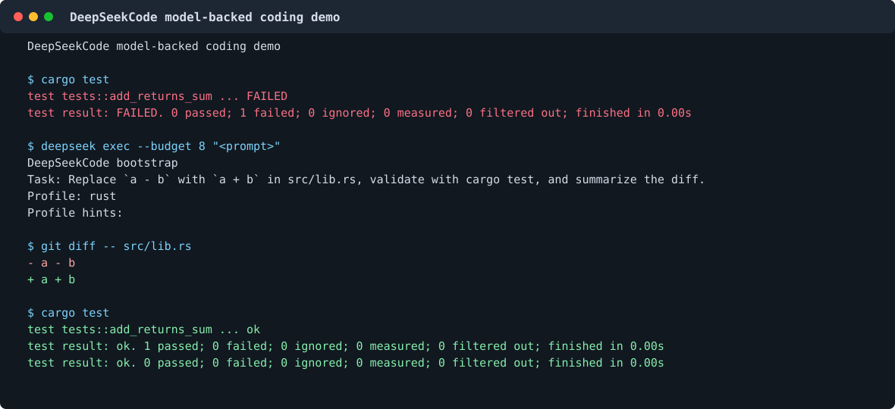

# DeepSeekCode

[English](./README.md) | [中文](./README.zh-CN.md) | [日本語](./README.ja-JP.md)

DeepSeekCode は DeepSeek-first のターミナル code agent です。ローカル開発の
ループ、つまりリポジトリを読み、ファイルを編集し、チェックを実行し、diff を確認し、
同じターミナルで作業を続ける流れを前提にしています。

> Public beta status: Linux/macOS の dogfood とリポジトリ作業には今日から利用できます。
> `v0.1.3` は GitHub Release binaries、検証済み GHCR image、TUI/service smoke gates、
> `deepseek quickstart`、release-binary smoke verifier、検証済み Homebrew tap を
> 備えています。npm registry publishing、より広い external repo evidence、
> リッチな launch media は引き続き product-hardening work です。

<p align="center">
  
</p>

<p align="center">
  <strong>Real model-backed edit and test loop</strong><br>
  
</p>

## 目的

DeepSeekCode は単なる chat wrapper ではなく、Claude Code CLI / Codex CLI に近い
ターミナル開発体験を目指しています。デフォルトの流れは terminal-first で
repo-aware です。

- 実 TTY で `deepseek` を実行すると full-screen coding-agent TUI が開きます。
- `deepseek chat` で line-oriented REPL も使えます。
- `deepseek run` で単発の coding task を実行できます。
- sessions、threads、events、tasks、usage、automations は `.dscode/runtime/`
  に永続化されます。
- file tools、patch、diff review、rollback、todos、hooks、skills、subagents、
  diagnostics、MCP/ACP、local runtime APIs は同じ permission と recovery path を使います。
- shell work は foreground commands、background jobs、replay、bounded
  interactive attach、stdin、resize metadata、cancellation、local shell-supervisor
  bridge をサポートします。

## クイックスタート

Homebrew でインストール:

```bash
brew tap willamhou/deepseekcode
brew install deepseek
deepseek version
deepseek quickstart
```

またはソースからインストール:

```bash
cargo install --git https://github.com/willamhou/DeepSeekCode.git --locked
deepseek version
deepseek quickstart
deepseek doctor --json
```

または release archive をダウンロード:

```bash
deepseek update download-plan --version 0.1.3
curl -L -o deepseek-linux-x64.tar.gz \
  https://github.com/willamhou/DeepSeekCode/releases/download/v0.1.3/deepseek-linux-x64.tar.gz
curl -L -o deepseek-linux-x64.tar.gz.sha256 \
  https://github.com/willamhou/DeepSeekCode/releases/download/v0.1.3/deepseek-linux-x64.tar.gz.sha256
shasum -a 256 -c deepseek-linux-x64.tar.gz.sha256
tar -xzf deepseek-linux-x64.tar.gz
./deepseek version
```

または公開済み container を実行:

```bash
docker run --rm ghcr.io/willamhou/deepseekcode:0.1.3 version
```

local checkout からインストール:

```bash
cargo install --path .
deepseek quickstart
deepseek config init
printf '%s\n' '<api-key>' | deepseek config auth DEEPSEEK_API_KEY --stdin
deepseek doctor --json
```

coding task を実行:

```bash
deepseek
deepseek chat
deepseek run "explain the current repository structure"
```

local runtime を起動して TUI から接続:

```bash
deepseek serve --http --addr 127.0.0.1:13000
deepseek tui --runtime-url http://127.0.0.1:13000
```

実モデル呼び出しには `DEEPSEEK_API_KEY` を設定してください。local `.env` files は
git から無視されます。

## 利用できる機能

- Full-screen TUI: Plan / Agent / YOLO modes、approval modal、command palette、
  setup/onboarding、provider/model picker、MCP management。
- REPL: raw-mode line editor、history、session list/load completion、SIGINT cancel、
  `/save`、`/load`、`/sessions`、custom slash commands。
- OpenAI-compatible single tool call と same-turn batch tool calls。どちらも通常の
  hook、permission、recovery layer を通ります。
- `deepseek quickstart` と `deepseek quickstart --json` による first-run checks。
- Local HTTP/SSE runtime、ACP stdio adapter、MCP client/server surface、明示的な
  trust/approval で制御される side-effect tooling。
- RLM helpers: recursive/long-input analysis、model-session context、live queue
  status、event replay、cancel、recover、drain controls。
- Linux/macOS/Windows entrypoints は CI smoke 済み。release assets は Linux x64、
  Linux arm64、macOS x64、macOS arm64、Windows x64 を含みます。
- 実 model-backed README demo と online multi-file external fixture evidence を
  記録済みです。

## 現在の制限

Linux/macOS local CLI milestone に絞れば、中心となる interaction loop はすでに
成立しています。残りは主に evidence depth と distribution polish です。

- npm registry publishing と public `npm install` verification。
- Python invoice sample 以外の optional external repo fixtures。
- committed model-backed SVG 以外の optional GIF/MP4 launch media。

Windows long-tail service proof、hosted IDE evidence、installed service proof は
より広い product hardening であり、Linux/macOS local code-agent CLI milestone の
blocker ではありません。

## Evidence

よく使う local checks:

```bash
cargo fmt --check
cargo test --lib -- --test-threads=1
node scripts/check-secrets.js
deepseek quickstart --json
deepseek update publish-status --json
deepseek update release-smoke --version 0.1.3 --json
deepseek tui --entrypoint-smoke --smoke-bin "$(command -v deepseek)"
```

release と dogfood evidence:

- [Release checklist](./docs/release.md)
- [Dogfood evidence](./docs/dogfood-evidence.md)
- [Current status](./docs/current-status.md)

## Documentation

- [Install](./docs/install.md)
- [Public beta guide](./docs/public-beta.md)
- [Current status and roadmap](./docs/current-status.md)
- [Launch kit](./docs/launch/README.md)
- [Release checklist](./docs/release.md)
- [Dogfood evidence](./docs/dogfood-evidence.md)
- [Demo assets](./docs/demo/README.md)
- [Architecture](./docs/architecture.md)
- [Runtime contract](./docs/runtime.md)
- [TUI workbench](./docs/tui.md)
- [REPL mode](./docs/repl.md)
- [Agent tasks](./docs/agents.md)
- [Skills and profiles](./docs/skills-and-profiles.md)
- [PR / CI integration](./docs/pr-integration.md)
- [Roadmap](./docs/roadmap.md)
- [Changelog](./CHANGELOG.md)

## Repository Notes

このリポジトリは透明性と協力のために公開されています。公開されていることは、
[LICENSE](./LICENSE) の範囲を超える別の open-source grant を意味しません。

local credentials、API keys、runtime state、private `.env` files をコミットしないでください。
tracked examples は placeholder のみを使います。
