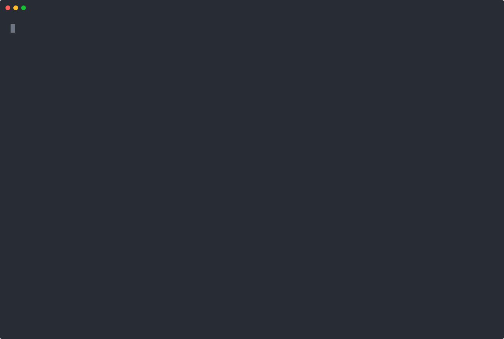

# DeepSeekCode

[English](./README.md) | [中文](./README.zh-CN.md) | [日本語](./README.ja-JP.md)

[](https://github.com/willamhou/DeepSeekCode/actions/workflows/ci.yml)
[](https://github.com/willamhou/DeepSeekCode/actions/workflows/release.yml)
[](https://www.npmjs.com/package/@deepseek-code/cli)
[](https://github.com/willamhou/DeepSeekCode/releases/latest)

DeepSeekCode is a DeepSeek-first terminal code agent for the local development
loop: inspect a repository, edit files, run checks, review the diff, and keep
working from the same terminal.

> Public beta status: usable today for Linux/macOS dogfooding and repository
> work. `v0.1.5` ships GitHub Release binaries, a verified GHCR image, TUI and
> service smoke gates, `deepseek quickstart`, a release-binary smoke verifier,
> a verified Homebrew tap, verified npm/npx install paths, and model-backed
> README launch media. Larger external repo evidence and broader hosted product
> proof are still product-hardening work.

## Try It

```bash
npm install -g @deepseek-code/cli
deepseek quickstart
deepseek
```

No install:

```bash
npx @deepseek-code/cli quickstart
```

Homebrew:

```bash
brew tap willamhou/deepseekcode
brew install deepseek
deepseek quickstart
```

<p align="center">
  <strong>DeepSeekCode interactive REPL builds a playable 2048 game from an empty repo</strong><br>
  
</p>

<p align="center">
  <strong>Generated game, played locally</strong><br>
  <a href="./docs/demo/deepseek-code-2048-interactive-gameplay.mp4">
    
  </a><br>
  <sub>Both recordings come from the same real interactive <code>deepseek chat</code> run against an empty disposable web repo.</sub>
</p>

## Why It Exists

DeepSeekCode is meant to feel closer to Claude Code CLI or Codex CLI than to a
plain chat wrapper. The default path is terminal-first and repo-aware:

- `deepseek` opens the full-screen coding-agent TUI in a real TTY.
- `deepseek chat` keeps the line-oriented REPL available.
- `deepseek run` executes one-shot coding tasks.
- Sessions, threads, events, tasks, usage, and automations are persisted under
  `.dscode/runtime/`.
- File tools, patching, diff review, rollback snapshots, todos, hooks, skills,
  subagents, diagnostics, MCP/ACP, and local runtime APIs share the same
  permission and recovery paths.
- Shell work supports foreground commands, background jobs, replay, bounded
  interactive attach, stdin, resize metadata, cancellation, and a local
  shell-supervisor bridge.

## Quick Start

Install with npm:

```bash
npm install -g @deepseek-code/cli
deepseek version
deepseek quickstart
```

Or run without installing:

```bash
npx @deepseek-code/cli version
npx @deepseek-code/cli quickstart
```

Install with Homebrew (verified on macOS x64/arm64):

```bash
brew tap willamhou/deepseekcode
brew install deepseek
deepseek version
deepseek quickstart
```

Or install from source:

```bash
cargo install --git https://github.com/willamhou/DeepSeekCode.git --locked
deepseek version
deepseek quickstart
deepseek doctor --json
```

Or download a release archive:

```bash
deepseek update download-plan --version 0.1.5
curl -L -o deepseek-linux-x64.tar.gz \
  https://github.com/willamhou/DeepSeekCode/releases/download/v0.1.5/deepseek-linux-x64.tar.gz
curl -L -o deepseek-linux-x64.tar.gz.sha256 \
  https://github.com/willamhou/DeepSeekCode/releases/download/v0.1.5/deepseek-linux-x64.tar.gz.sha256
shasum -a 256 -c deepseek-linux-x64.tar.gz.sha256
tar -xzf deepseek-linux-x64.tar.gz
./deepseek version
```

Or run the published container:

```bash
docker run --rm ghcr.io/willamhou/deepseekcode:0.1.5 version
```

For a local checkout:

```bash
cargo install --path .
deepseek quickstart
deepseek config init
printf '%s\n' '<api-key>' | deepseek config auth DEEPSEEK_API_KEY --stdin
deepseek config preset auto
deepseek doctor --json
```

Run a coding task:

```bash
deepseek
deepseek chat
deepseek run --preset auto "explain the current repository structure"
```

Start the local runtime and connect the TUI:

```bash
deepseek serve --http --addr 127.0.0.1:13000
deepseek tui --runtime-url http://127.0.0.1:13000
```

Set `DEEPSEEK_API_KEY` for real model calls. Local `.env` files are ignored by
git.

## What Works

- Full-screen TUI with Plan / Agent / YOLO modes, approval modals, first-run
  setup guidance, live agent task timeline, command palette, provider/model
  picker, and MCP management.
- REPL with raw-mode line editing, history, session list/load completion,
  SIGINT cancellation, `/save`, `/load`, `/sessions`, and custom slash commands.
- OpenAI-compatible single and same-turn batch tool calls, with independent
  read-only chunks parallelized conservatively and writes/shell/approvals kept
  as serial barriers.
- Recoverable DeepSeek-style malformed tool-call arguments are repaired through
  a bounded pipeline and recorded as observable runtime repair events.
- Runtime evidence commands: `deepseek stats`, `deepseek events replay`, and
  `deepseek events diff` summarize cost/cache/tool/failure traces without
  reading raw `.dscode/runtime` JSON.
- DeepSeek model presets and estimated-cost budgets sync into runtime
  session/thread records, so TUI and daemon task sessions can enforce or clear
  budgets across process restarts.
- Guided first-run checks through `deepseek quickstart` and
  `deepseek quickstart --json`.
- Local HTTP/SSE runtime, ACP stdio adapter, MCP client/server surfaces, and
  side-effect tooling behind explicit trust/approval controls.
- RLM helpers for recursive and long-input analysis, model-session context,
  live queue status, event replay, cancellation, recovery, and drain controls.
- CI-smoked Linux/macOS/Windows entrypoints plus release assets for Linux x64,
  Linux arm64, macOS x64, macOS arm64, and Windows x64.
- Verified model-backed README demos and online multi-file external fixture
  evidence for the current release-readiness path.

## Current Limits

For the Linux/macOS local CLI milestone, the core interaction loop is already in
place. The remaining gaps are mainly evidence depth and product hardening:

- optional larger external repo fixtures beyond the disposable Python/Rust/Node
  samples.

Windows long-tail service proof, hosted IDE evidence, and installed service
proof are broader product-hardening work. They are not blockers for the
Linux/macOS local code-agent CLI milestone.

## Evidence

Useful local checks:

```bash
cargo fmt --check
cargo test --lib -- --test-threads=1
node scripts/check-secrets.js
deepseek quickstart --json
deepseek dogfood repair-cache-evidence --json
deepseek stats --json
deepseek events replay <thread-id> --limit 50
deepseek events diff <before-thread-id> <after-thread-id> --json
deepseek update publish-status --json
deepseek update release-smoke --version 0.1.5 --json
deepseek tui --entrypoint-smoke --smoke-bin "$(command -v deepseek)"
```

For release and dogfood evidence, see:

- [Release checklist](./docs/release.md)
- [Evidence summary](./docs/evidence.md)
- [Dogfood evidence](./docs/dogfood-evidence.md)
- [Current status](./docs/current-status.md)
- Additional demos: [scripted 2048 capture](./docs/demo/deepseek-code-2048-terminal-demo.svg),
  [TUI recording](./docs/demo/deepseek-code-tui-demo.svg), and
  [model-backed edit/test loop](./docs/demo/deepseek-code-model-demo.svg)

## Documentation

- [Install](./docs/install.md)
- [Public beta guide](./docs/public-beta.md)
- [Current status and roadmap](./docs/current-status.md)
- [Launch kit](./docs/launch/README.md)
- [Release checklist](./docs/release.md)
- [Evidence summary](./docs/evidence.md)
- [Dogfood evidence](./docs/dogfood-evidence.md)
- [Demo assets](./docs/demo/README.md)
- [Architecture](./docs/architecture.md)
- [DeepSeek-native loop design](./docs/deepseek-native-loop.md)
- [Runtime contract](./docs/runtime.md)
- [TUI workbench](./docs/tui.md)
- [REPL mode](./docs/repl.md)
- [Agent tasks](./docs/agents.md)
- [Skills and profiles](./docs/skills-and-profiles.md)
- [PR / CI integration](./docs/pr-integration.md)
- [Roadmap](./docs/roadmap.md)
- [Changelog](./CHANGELOG.md)

## Acknowledgements

DeepSeekCode is independently implemented, but several compatibility surfaces
and terminal-agent workflow ideas were informed by
[Hmbown/CodeWhale](https://github.com/Hmbown/CodeWhale), formerly
DeepSeek-TUI. DeepSeekCode does not vendor or copy CodeWhale source code; the
compatibility work is tracked as interface and workflow parity.

## Repository Notes

This repository is public for transparency and collaboration. Public visibility
does not imply a separate open-source grant beyond the terms in
[LICENSE](./LICENSE).

Do not commit local credentials, API keys, runtime state, or private `.env`
files. The tracked examples use placeholders only.
